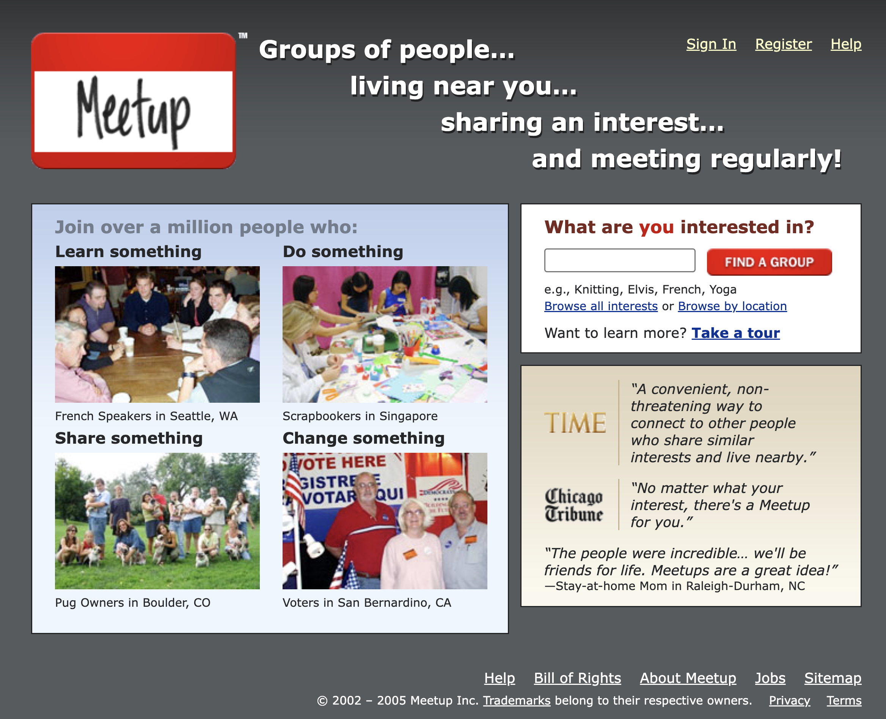
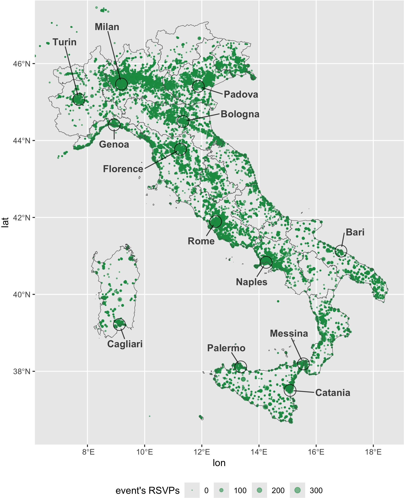
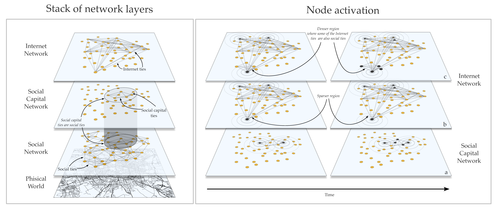
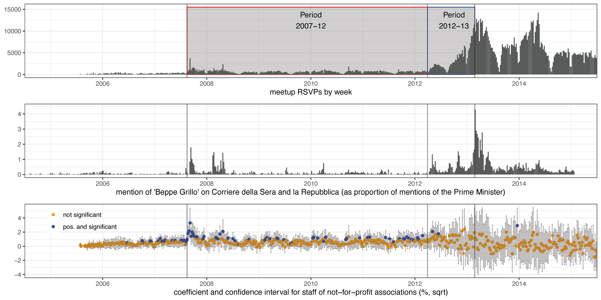
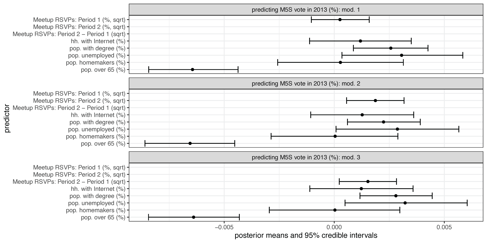

* [Publisher version (open access)](https://doi.org/10.1080/19331681.2025.2494116)
* [Replication materials](https://doi.org/10.7910/DVN/MNHJTQ)
* [Presentation slides](https://fraba.github.io/presentation/2024-WSU)

In an era of declining trust in political parties and traditional organizations, how do movements break through to those who have tuned out of politics altogether? 

In this article, published in the *Journal of Information Technology & Politics*, I explore how digital media — particularly platforms like Meetup.com — helped Italy’s Five Star Movement (M5S) mobilize the politically disengaged.

*Meetup.com home page as of July 2005 (source: the Internet Archive).*

Using data on over 45,000 local events organized between 2005 and 2013, alongside census and electoral data, I trace how grassroots political participation evolved — and how the internet opened new doors beyond traditional social networks.

*Geocoded meetup events present in the data.*

## From Civic Associations to Digital Meetups

Traditionally, political mobilization has depended on social capital — dense networks built through civic associations, unions, and community groups. These networks connect people, build civic skills, and validate political participation. But as mass political parties and civic organizations have shrunk since the 1960s, many areas, especially those with lower social capital, have been left behind.

In its early days, M5S meetups were concentrated in regions rich in civic associations — confirming that even digital activism first piggybacked on legacy networks. But everything changed around 2012, when news media began spotlighting M5S's political successes. Meetup activity spread rapidly into low-social capital areas — reaching communities that had long been politically disengaged.

## Internet Capital: A New Resource for Mobilization

To explain this shift, I introduce the concept of *Internet capital*: digital resources that enable collective action independent of preexisting social ties. Unlike traditional mobilization, Internet capital is geographically unconstrained — it can connect isolated individuals around shared interests rather than physical proximity.

*Theoretical activation model for local collective action.*

However, Internet networks also have a downside: they tend to be weaker and more transient than traditional social ties. That’s where the role of legacy media becomes crucial. Public attention from newspapers and TV helped reinforce and validate digital activism, temporarily strengthening these fragile networks and sparking broader collective action.

*Timeseries of meetup RSVPs, news media attention variables and posterior means for the staff of not-for-profit association predicting RSVPs.*

## Mobilizing Disengaged Voters

The research shows that in areas where second-wave meetups grew after 2012, M5S achieved stronger electoral support in the 2013 general election. More importantly, in places with new Meetup activity, voters reported talking about politics more frequently — even those previously disconnected from civic associations.

*Spatial areal unit modeling for M5S vote in 2013.*

This is a critical insight: Internet-enabled grassroots activity didn’t just reach existing activists. It diffused political expertise into new social spaces, helping mobilize pools of passive political discontent crucial for M5S's success.

## Why It Matters

The findings highlight that while digital technologies can diversify participation, they need validation from traditional media to achieve large-scale impact. Internet-powered movements can bypass the geographic and demographic barriers that restrict traditional mobilization — but they must navigate the challenges of building lasting engagement without the cohesive ties of social capital.

In an age of political turbulence and media hybridity, understanding these dynamics is more important than ever. Internet capital offers both an opportunity and a challenge for political movements aiming to reach the disengaged — reshaping not only how people participate, but who participates in the first place.

**Cite** Bailo, F. (2025). Breaking out of legacy mobilization networks: How the Internet reaches and activates the politically disengaged. *Journal of Information Technology & Politics*.
